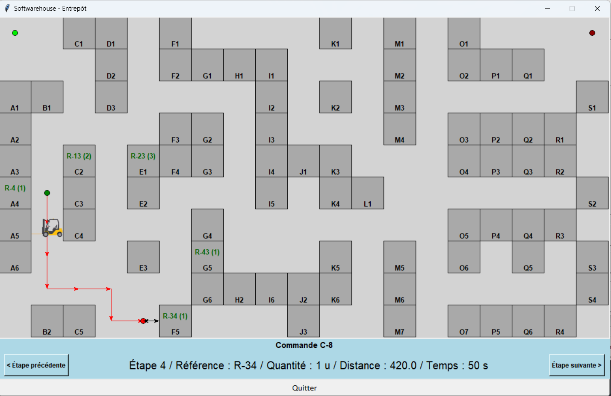

___

# Softwarehouse

Python and Tkinter application to manage a warehouse and orders

## Lancement :

- Clôner le dépôt :

```sh
git clone https://github.com/thomas-cvt/softwarehouse.git
```

- Créer un environnement virtuel python et l'activer :

```sh
python -m venv env
source ./env/Scripts/activate
```

- Lancer le fichier principal :

```sh
python Main.py
```
**Le programme est déjà fourni avec des données de test. Le nom d'utilisateur est alors ```admin``` et le mot de passe ```password```.**

**Pour remettre à zéro les données, vider le contenu des 5 fichiers contenus dans le dossier ```./data```.**

## Fichiers ```commandes.json```

Ce fichier contient la liste des commandes. Il doit être généré ou crée depuis une source externe selon ce format :

```json
[
  {
    "id": "C-1",
    "client": "Intellisys",
    "date": "05/03/2023",
    "contenu": {
      "R-34": 2,
      "R-12": 9,
      "R-43": 15
    },
    "traitee": true,
    "operateur": "admin"
  },
  {
    "id": "C-2",
    "client": "Novatek",
    "date": "23/04/2023",
    "contenu": {
      "R-35": 1,
      "R-47": 8,
      "R-9": 7
    },
    "traitee": false,
    "operateur": ""
  },
  {
    "id": "C-3",
    "client": "SylverTech",
    "date": "06/12/2023",
    "contenu": {
      "R-37": 2,
      "R-50": 8,
      "R-31": 3,
      "R-25": 2
    },
    "traitee": false,
    "operateur": ""
  }
]
```

Les autres fichiers de données (```boxs.csv```, ```entrepot.csv```, ```references.csv```, ```users.csv```) seront générés et gérés par le programme au cours de son éxecution.

## Première connexion :

Lors de votre première connexion, vous serez invité à renseigner:
- la disposition spatiale de votre entrepôt. Cliquez sur les cases occupées par des boxs de stockage puis appuyer sur "Sauvegarder" pour passer à l'étape suivante (voir aussi Modifier l'entrepôt).
- les emplacements de départ et d'arrivée des préparateurs de commande.

Vous devrez ensuite créer un compte administrateur en renseignant les informations demandées ( voir aussi AJOUTER UN COMPTE UTILISATEUR)

## Paramètres :

Dans le fichier sttings.py, il est possible de modifier différents paramètres qui impactent le fonctionnement et l'aspect du programme :
- paramètres graphique : seuils d'alerte de stock, couleurs...
- paramètres fonctionnels : préfixe des commandes, des références, taille de l'entrepôt, vitesse de déplacement, mode de calcul de chemin...

Le calcul de chemin peut se faire selon 3 modes prenant en compte la distance, la durée ou le poids de façon prépondérante

## Ajouer un compte utilisateur :

Il est possible d'ajouter des utilisateurs en cliquant sur "Ajouter un utilisateur" dans la fenêtre "Menu principal". Vous serez invité à renseigner des informations sur cet utilisateur et notamment son statut administrateur ou non (voir rubrique UTILISATEUR ADMINISTRATEUR)


## Utilisateur administrateur :

Il est possible d'octroyer les droits d'administrateur à certains utilisateurs, les administrateurs peuvent :
- Ajouter une référence (voir Ajouter référence)
- Editer et Supprimer une référence (voir Edition référence)
- Ajouter un utilisateur (voir Ajouter un compte utilisateur)
- Modifier l'entrepôt (voir Modifier l'entrepôt)


## Ajouter référence :

Pour ajouter une nouvelle référence dans votre entrepôt, il est nécessaire d'être administrateur (voir UTILISATEUR ADMINISTRATEUR). Cliquez sur "Ajouter une référence" dans la fenêtre "Menu principal". Dans la fenêtre "Création référence", vous serez invité à remplir les informations suivantes :
- Désignation, prix, poids, stockage
- Emplacement : pour sélectionner un emplacement, cliquez sur "Modifier" en face de "Emplacement". Un plan de l'entrepôt apparaît. Cliquez sur le box vide où se trouvera la référence. Si le box est déjà occupé, vous ne pouvez pas y ajouter cette référence.


## Modifier l'entrepôt :

Pour modifier la disposition de votre entrepôt, il est nécessaire d'être administrateur (voir UTILISATEUR ADMINISTRATEUR).
- Cliquez sur "Modifier l'entrepôt" dans la fenêtre "Menu principal".
- dans la fenêtre "Entrepôt" qui apparaît, cliquez sur les cases occupées par des boxs de stockage : elles apparaîttront en bleu. Pour déselectionner une case, cliquez dessus.
- appuyez sur "Sauvegarder" pour passer à l'étape suivante.
- cliquez pour sélectionner une case de départ (en vert) et cliquez sur "Sauvegarder"
- cliquez pour sélectionner une case d'arrivée (en rouge) et cliquez sur "Sauvegarder"
Tous les boxs doivent être accessibles depuis le point d'arrivée et de départ pour que la configuration soit sauvegardée.


## Fonctionnalités générales :
La fenêtre "Menu principal" permet de visualiser le stock de chaque référence et d'accéder à toutes les fonctionnalités :

les fonctionnalités suivantes sont accessibles :
- Chercher une référence (voir Recherche et édition référence)
- Trier et filter les références affichées
- Gérer les commandes (voir Gestion des commandes)
- Afficher l'entrepôt et les chemins pour la préparation des commandes

pour les administrateurs, des fonctionnalités supplémentaires sont accessibles (voir aussi Utilisateur administrateur) :
- Editer / Supprimer une référence (voir Recherche et édition de référence)
- Ajouter une référence (voir Ajouter référence)
- Modifier l'entrepôt (voir Modifier l'entrepôt)
- Ajouter un utilisateur (voir Ajouter un compte utilisateur)


## Recherche et Édition de référénce :
Pour afficher les détails ou modifier une référence, pour les administrateurs (voir Utilisateur administrateur) :
- double-cliquez sur une référence 
- ou cliquez sur "Rechercher une référence" et entrez le numéro de la référence

## Gestion des commandes :
Pour accéder à l'interface de gestion des commandes, cliquez sur "Gérer commandes" sur le menu principal.
Cet interface permet de :
- visualiser la liste des commandes et leurs caractéristiques
- visualiser les détails d'une commande en double-cliquant dessus   
- préparer une commande
- valider une commande 
- trier les commandes
- visualiser des statistiques sur les commandes

## Préparer une commande :
Pour visualiser le parcours à effectuer dans l'entrepôt pour préparer une commande, il faut d'abord visualiser les détails celle-ci.
Puis en cliquant sur le bouton "Préparer la commande", l'entrepôt s'affiche et à l'aide des boutons étapes, vous pouvous naviguez vers
les produits et observer le chemin calculé.

## Valider une commande :
Valider une commande signifie la marquer comme accomplie. De ce fait, les stocks des références sont mis à jour en décomptant la quantité désirée au stock actuel. Ceci peut être fait par le bouton "Valider la commande".